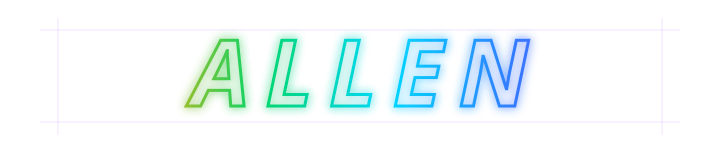

<h1 align="center">
    
  </h1>

  

    🎓 Master's Student @ South China University of Technology (SCUT)
     
    🧠 Exploring AI Agent | AI Native | Human-Agent Collaboration
     
  

  ---

  

    
    
    
    
  

  ---
<h1>
    
  </h1>

  > **AI Agent**
  > I am interested in building autonomous, tool-using, and context-aware intelligent agents that can understand goals, reason over tasks, and collaborate with humans in real-world workflows.
  >
  > 我关注具备自主性、工具调用与上下文理解能力的 AI Agent，探索智能体如何理解目标、拆解任务，并在真实工作流中与人类协作。

  > **AI Native Applications**
  > I am exploring software systems designed around AI from the beginning, where models, tools, data, and user interaction are deeply integrated into the product experience.
  >
  > 同时，我也在探索 AI Native 应用形态——从底层就围绕 AI 能力构建的软件系统，让模型、工具、数据与交互体验深度融合。

  ---

  <h1>
    
  </h1>

  > I hope to build useful, elegant, and intelligent systems that go beyond traditional software.
  > My long-term goal is to explore how AI Agents can become capable collaborators, helping people think, create, and solve complex problems more effectively.
  >
  > 我希望构建真正有用、优雅且智能的系统。
  > 长期来看，我想探索 AI Agent 如何成为人类可靠的协作者，帮助人们更高效地思考、创造和解决复杂问题。

  ---

  <h1>
    
  </h1>

  

    
    
       
      
  

  ---

  

    
  

